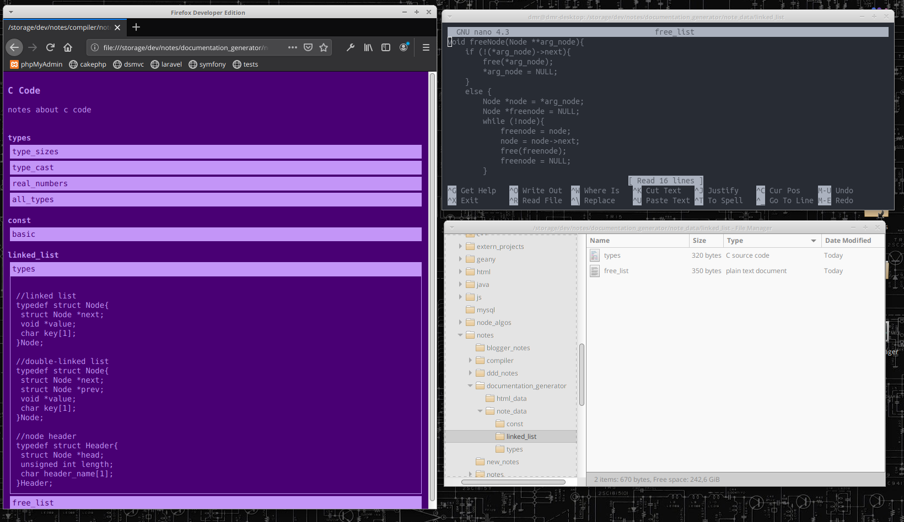

# DSNoteGen

### Documentation / Personal Notes Generator

---

## About

Bash script that generates documentation from directories and text files.

## Directory Structure

Documentation 'source' dir is 'note_data'. Directories inside are
used as groups while text files inside them are notes that will appear
in html under group. 

## File Naming

Group and text note names must be named with underscore instead of whitespace.

## Bash Script

Script collects text files from 'note_data/group_name', encodes strings (html entities)
and 'compiles' output html file.

## config.ini
		FRONT_COLOR="#C395F7" - Set font color
		BACK_COLOR="#490074" - Set background color
		PROJECT_TITLE="C Code" - Set html document title
		PROJECT_SUBTITLE="notes about c code" - Set html document sub-title
		OUTPUT_FILE="notes.html" - Set html output filename
